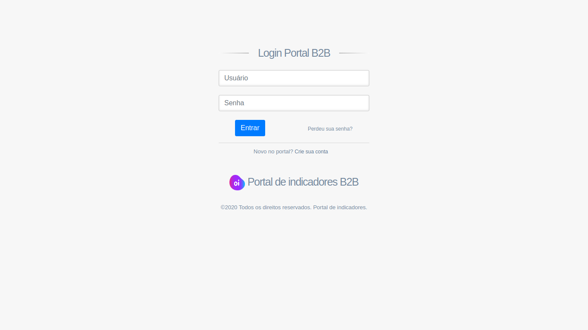
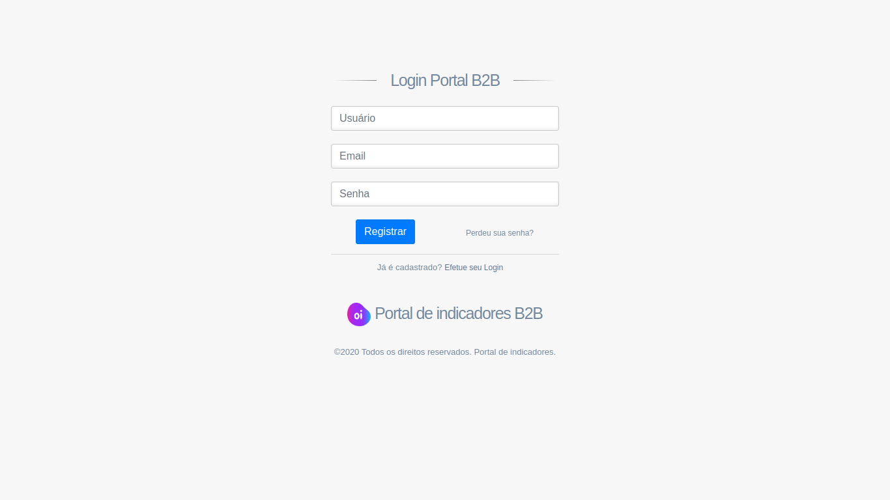
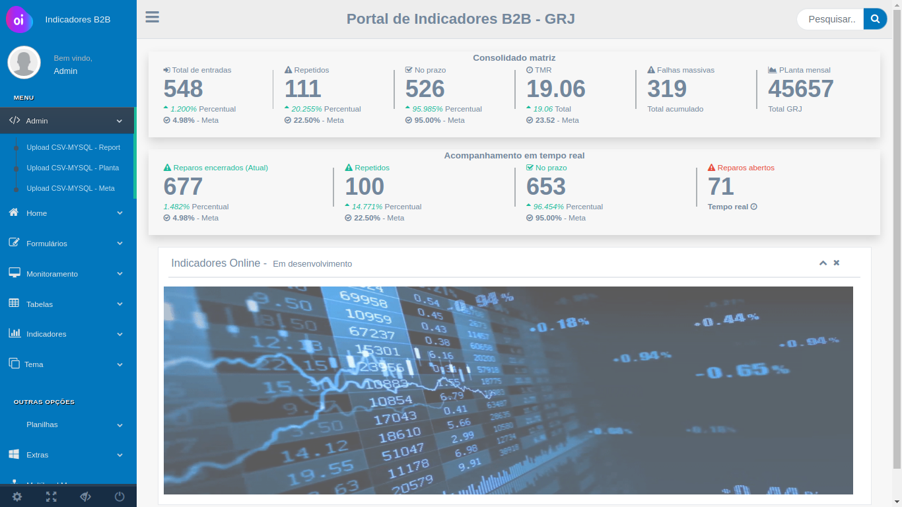
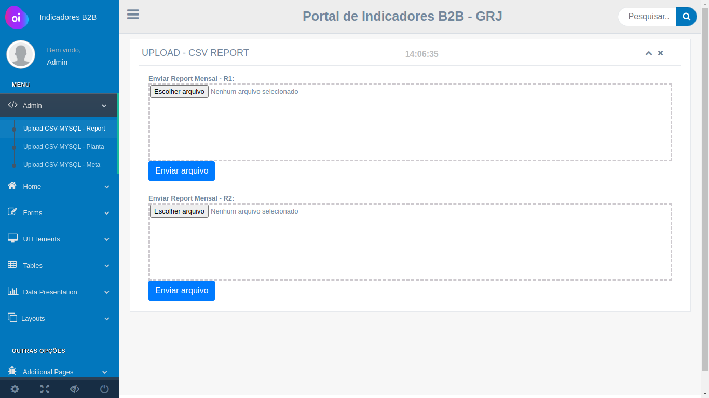

  =v7.1.3&color=blue&style=for-the-badge&logo=MYSQL"/>        
  

<h3 align="center">  B2B Portal </h3>
  
 

        ### O projeto Oi B2B Portal é um sistema que nasceu para solucionar problemas do Grupo Oi relacionados à
    visualização organizada dos números da companhia, onde os mesmos números são dispersos em diversos tipos 
    de sistemas e softwares como planilhas excel, sistemas web que resolvem outros tipos de problemas com 
    alguns números da companhia entre outros. A questão principal do Oi B2B Portal é reunir e centralizar todos
    os números da organização de maneira a conseguir transformar os mesmos números em gŕaficos e também tratá-los
    de forma que consiga-se transformar números em informação para apoiar a tomada de decisões dos gestores e 
    principais usuários do sistema, entretanto este sistema está sendo projetado para acoplar-se a outros sistemas
    e também incorporar em si próprio uma nova versão de outros sistemas legados onde além da função principal de 
    servir como um portal de indicadores ele também será desenvolvido com diversas features de outros softwares legados

### Algumas das principais funcionalidades do sistema

Cadastro de usuário :heavy_check_mark: 
Niveis de permissão de usuário :heavy_check_mark: 
Envio de alertas no Telegram :heavy_check_mark: 
Card offline D-1 de indicadores com os resultados consolidados da Matriz :heavy_check_mark: 
Card online de indicadores (Tempo real) com todos os resultados :heavy_check_mark: 
Área para envio de CSV para alimentação da base de dados com resultados da matriz :heavy_check_mark: 
Área para envio de CSV com dados de planta mensal :heavy_check_mark: 
Área para envio de CSV referentes as Metas mensal e anual :heavy_check_mark: 
Utilização de requisições assincronas para monitorar dados em tempo real :heavy_check_mark: 
Consumo de base de dados PostgreSql externa para acompanhamento de alguns indicadores :heavy_check_mark: 

### Tecnologias

- [X] PHP v7.1
- [X] MySql
- [X] Bootstrap v4
- [X] Css
- [X] Html
- [X] Python 3.6 -> Externo ao software (Apoia a plataforma com extração de dados)
- [X] Ajax -> Jquery

### Status do projeto
> Status do Projeto: Em desenvolvimento :warning:

### Screenshots

### Atenção:warning:

Indicadores utilizados em screenshots são completamente ficticios não expondo assim dados privados da organização!

### Algumas considerações finais

Lançamento da primeira versão do sistema que contempla todas as features descritas no Readme do projeto. Estou lançando tudo em apenas um commit, pois ocorreram diversos problemas e contratempos com o repositório anterior entao preferi deixar as coisas mais clean colocar a primeira versão utilizável do sistema em apenas um commit... Esta primeira versão é meio que um MVP onde apenas algumas features estão dispostas no software faltando muita coisa ainda para o mesmo ficar completo.
 
Versão bem resumida porém complexa e que contempla a principal feature que são os cards
na página inicial da plataforma, estes cards são referentes a alguns dos principais números da companhia
onde o primeiro card é um consolidado D-1 que é disponibilizado pela Matriz principal da organização
já o Card online é algo inovador onde foi desenvolvido algumas formas de consumir outros sistemas de maneira
a reunir todos os dados online e em tempo real. 

 

### Desenvolvedor

Renato Augusto

